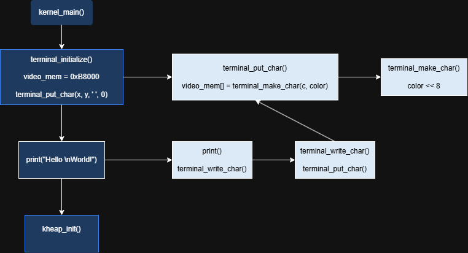

# Source Code

This directory contains the implementation of the operating system. Each subdirectory is responsible for a specific subsystem of the kernel. The goal is to keep the code modular, making it easier to understand, maintain, and extend.

## Directory Structure

* **boot/** – Bootloader and early startup code.
* **cpu/** – CPU-specific initialization and low-level architecture code.
* **disk/** – Disk access and block device interfaces.
* **filesystem/** – Filesystem implementations (e.g., FAT16).
* **memory/** – Heap management, paging, and memory allocation.
* **process/** – Process creation, scheduling, and task management.
* **terminal/** – Terminal and console output.
* **drivers/** – Hardware device drivers (keyboard, disk, serial, etc.).
* **io/** – Low-level input/output routines.
* **kernel/** – Core kernel initialization and main execution flow.
* **util/** – General-purpose utility functions used throughout the kernel.

> **Note:** The available directories may change as new subsystems are added.

## Development Goals

This project emphasizes understanding operating system internals rather than simply producing a working kernel. Each subsystem is implemented from first principles to explore concepts such as:

* Memory management
* Interrupt handling
* Process scheduling
* Filesystems
* Device drivers
* System calls
* Kernel architecture

## Code Organization

Each subsystem should strive to:

* Encapsulate related functionality.
* Minimize dependencies on other modules.
* Expose functionality through well-defined interfaces.
* Keep architecture-specific code separate from generic kernel logic.

## Reading Order

If you are new to the project, a recommended order for exploring the source code is:

1. Boot process
2. Kernel initialization
3. Memory management
4. Interrupt handling
5. Terminal and console
6. Disk subsystem
7. Filesystem
8. Process management
9. Device drivers

## Documentation

Many subsystems include diagrams and design notes located in the project's `docs/` directory. These documents illustrate memory layouts, data structures, pointer relationships, and execution flow to complement the source code.

