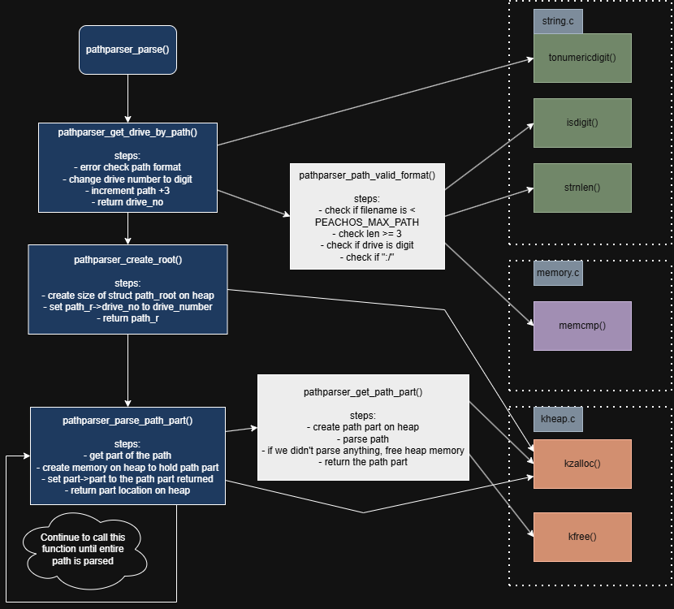

# file.c

# pathparser.c
    Purpose: Take a file path and split it into drive number, directory and file
    Parameter path: Full path, including drive, to parse.
    Parameter current_directory_path: *** not currently used ***
    Return: Path root.

